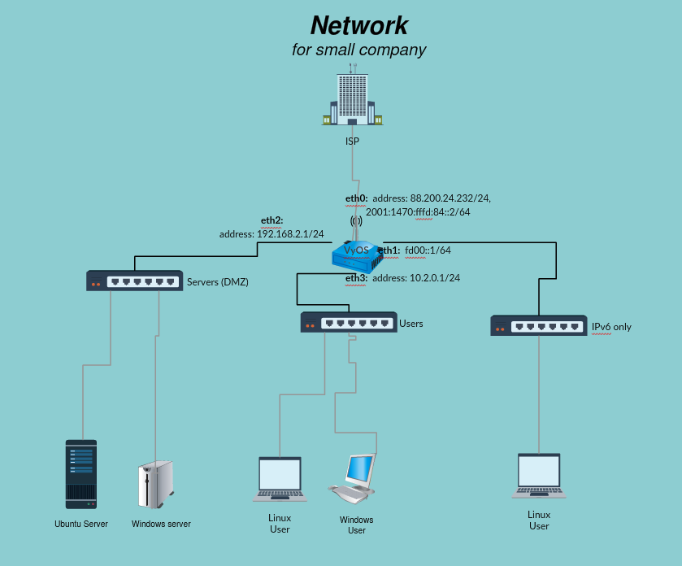

# README #

This README shows how to build network for a company with VMware ESXi type-1 hypervisor using VyOS for routing.

### The network ###
  

### Setup

First you need to install VyOS. Then we can configure the interfaces. Vyos has configuration and operational mode, you can only change configuration in configuration mode (configure), to save settings run commit and save.
``` bash
configure
set interfaces ethernet eth0 address '88.200.24.232/24'
set interfaces ethernet eth0 address '2001:1470:fffd:84::2/64'
set interfaces ethernet eth0 description 'ISP router'

set interfaces ethernet eth1 address '2001:1470:fffd:85::1/64'
set interfaces ethernet eth1 description 'IPv6 only'

set interfaces ethernet eth2 address '192.168.2.1/24'
set interfaces ethernet eth2 address '2001:1470:fffd:86::1/64'
set interfaces ethernet eth2 description 'DMZ zone'

set interfaces ethernet eth3 address '10.2.0.1/24'
set interfaces ethernet eth3 address '2001:1470:fffd:87::1/64'
set interfaces ethernet eth3 description 'Employees'
commit
save
```

To reach outside network e.g google dns server from router we need to add static route.
``` bash
set protocols static route 0.0.0.0/0 next-hop 88.200.24.1 distance '1'
set protocols static route6 ::/0 next-hop 2001:1470:fffd:84::1 distance '1'
```
To configure DNS with caching disabled for employees subnet and vyos
``` bash
set service dns forwarding name-server 8.8.8.8 # google dns server
set service dns forwarding name-server 193.2.1.66 # arnes dns server
set service dns forwarding cache-size 0
set service dns forwarding listen-on eth3 # users subnet
set service dns forwarding listen-on eth2 # dmz subnet
```
> set service dns forwarding listen-on <interface> Use this command to specify interfaces on which to listen for client DNS requests. Only queries received on interfaces specified with this command receive DNS answers. At least one interface must be specified for DNS forwarding to operate.

Next lets configure NAT
``` bash
set nat source rule 100 outbound-interface 'eth0'  #  For any traffic that is leaving interface eth0
set nat source rule 100 source address '10.2.0.0/24'
set nat source rule 100 translation address masquerade # Change it so it appears to be coming from the IP address of the interface.
set nat source rule 110 outbound-interface eth0
set nat source rule 110 source address 192.168.2.0/24 # For dmz subnet
set nat source rule 110 translation address masquerade 
```
> In this example, we use masquerade as the translation address instead of an IP address. The masquerade target is effectively an alias to say "use whatever IP address is on the outgoing interface", rather than a statically configured IP address. This is useful if you use DHCP for your outgoing interface and do not know what the external address will be.

Now lets set up DHCP for users subnet.
``` bash
set service dhcp-server shared-network-name inside authoritative enable
set service dhcp-server shared-network-name inside subnet 10.2.0.0/24 default-router 10.2.0.1
set service dhcp-server shared-network-name inside subnet 10.2.0.0/24 dns-server 10.2.0.1
set service dhcp-server shared-network-name inside subnet 10.2.0.0/24 lease 600 # set lease time to 10 min
set service dhcp-server shared-network-name inside subnet 10.2.0.0/24 start 10.2.0.100 stop 10.2.0.199
```

> set service dhcp-server shared-network-name <name> subnet <subnet> dns-server <address>. This is a configuration parameter for the subnet, saying that as part of the response, tell the client that I am the DNS server for this network. If you do not want to run a DNS server, you could also provide one of the public DNS servers, such as google's. You can add multiple entries by repeating the line.

Now lets set up DHCP for dmz.
``` bash
set service dhcp-server shared-network-name dmz authoritative enable
set service dhcp-server shared-network-name dmz subnet 192.168.2.0/24 default-router 192.168.2.1
set service dhcp-server shared-network-name dmz subnet 192.168.2.0/24 lease 600                 
set service dhcp-server shared-network-name dmz subnet 192.168.2.0/24 start 192.168.2.5 stop 192.168.2.155
set service dhcp-server shared-network-name dmz subnet 192.168.2.0/24 dns-server 192.168.2.1
# Static mapping for linux server
set service dhcp-server shared-network-name dmz subnet 192.168.2.0/24 static-mapping linux mac-address 00:0c:29:15:6b:33
set service dhcp-server shared-network-name dmz subnet 192.168.2.0/24 static-mapping linux ip-address 192.168.2.218
# Static mapping for windows
set service dhcp-server shared-network-name dmz subnet 192.168.2.0/24 static-mapping windows10 mac-address 00:0c:29:99:0e:7d
set service dhcp-server shared-network-name dmz subnet 192.168.2.0/24 static-mapping windows10 ip-address 192.168.2.220
# Staic mapping for windows server
set service dhcp-server shared-network-name dmz subnet 192.168.2.0/24 static-mapping windows-server mac-address 00:0c:29:bc:5d:8c
set service dhcp-server shared-network-name dmz subnet 192.168.2.0/24 static-mapping windows-server ip-address 192.168.2.222
```

To set-up ssh run
``` bash
set service ssh port 22
```

Now lets set-up NTP servers and delete default servers
``` bash
delete system ntp server 0.pool.ntp.org
delete system ntp server 1.pool.ntp.org
delete system ntp server 2.pool.ntp.org
set system ntp server ntp1.arnes.si 
set system ntp server ntp2.arnes.si 
```

SLAAC configuration for users subnet to enable ping6
``` bash
set interfaces ethernet eth3 ipv6 disable-forwarding 
set interfaces ethernet eth3 ipv6 address autoconf 
set interfaces ethernet eth3 ipv6 router-advert # enable RA
```

###Active Directory
Active Directory Domain Services (AD DC) can easily be installed through Server Manager app on Windows Server. AC DC
installer allows for phased implementation of new features on the domain controller with its functional levels. Numerous
functional levels such as Windows Server 2000, 2008, 2008 R2, 2012 and so on can be selected depending on the software
used by other network components. When other computers are upgraded the functional level can be raised on the domain 
controller to enable new and advanced features.

A distinction must be made between domain functional level and domain forest functional level. Domain functional level
specifies the domain the domain controller is in and that domain only, whereas forest specifies the functional
level for all domains associated with the given forest.